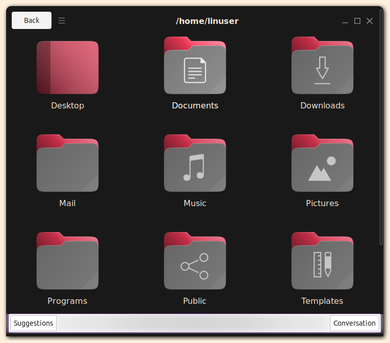

<head>
    <link rel="preload" href="styles.css" as="style">
    <link rel="stylesheet" href="styles.css">
    <title>Aerome</title>
    <meta name="viewport" content="width=device-width, initial-scale=1.0">
</head>

<header>

# Aerome
## A File Manager from the Future

- [About](index.html)
- [Blog](blog.html)
- [Source](https://github.com/PromptProgrammingLanguage/aerome)
- [Download](https://github.com/PromptProgrammingLanguage/aerome/releases/mac-os.zip)

</header>

<main>

<!--

-->

<iframe src="https://www.youtube.com/embed/dbZ2ObcZn2U?modestbranding=1" title="YouTube video player" allow="accelerometer; autoplay; clipboard-write; encrypted-media; gyroscope; picture-in-picture; web-share" allowfullscreen="" width="560" height="315" frameborder="0"></iframe>

</main>

<footer>
- ### Organize Files
  

- ### Share Your Files
  

- ### Merge and Sort
  
</footer>
