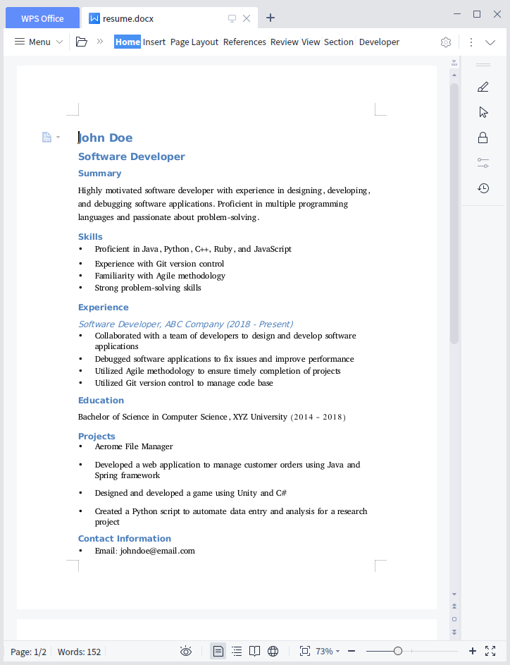

<video
    playsinline
    poster="assets/images/ss.png"
    id="demo"
    onclick="this.paused ? playDemo() : pauseDemo()">
    <source src="https://media.githubusercontent.com/media/AeromeFileManager/AeromeFileManager.github.io/master/assets/video/demo.mp4"></source>
</video>

