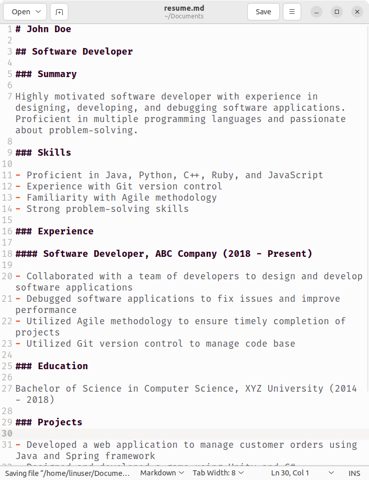

<head>
    <link rel="preload" href="styles.css" as="style">
    <link rel="stylesheet" href="styles.css">
    <title>Aerome</title>
    <meta name="viewport" content="width=device-width, initial-scale=1.0">
</head>

<header>

# Aerome
## A File Manager from the Future

- [About](index.html)
- [Blog](blog.html)
- [Source](https://github.com/PromptProgrammingLanguage/aerome)
- [Download](https://github.com/PromptProgrammingLanguage/aerome/releases/mac-os.zip)

</header>

<main class="demo-vid">

<video
    playsinline
    poster="assets/images/ss.png"
    id="demo"
    onclick="this.paused ? playDemo() : pauseDemo()">
    <source src="https://media.githubusercontent.com/media/AeromeFileManager/AeromeFileManager.github.io/master/assets/video/demo.mp4"></source>
</video>

</main>

<footer>
- ### Organize Files
  

- ### Manipulate Files
  

- ### Complex Tasks
  
</footer>

